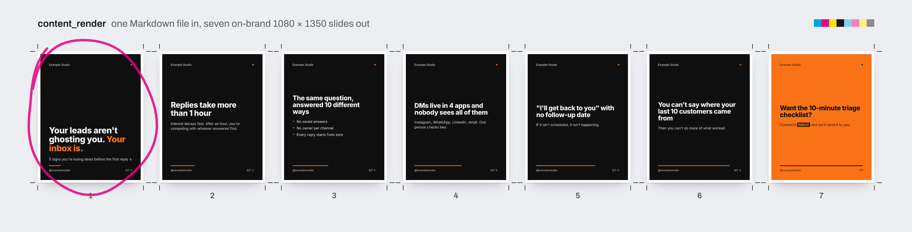
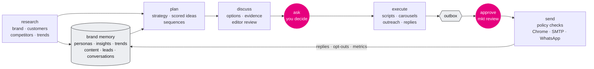
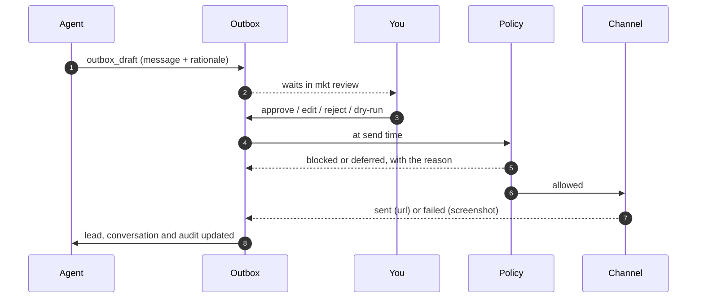

<p align="center">
  
</p>

<p align="center">
  <a href="#quick-start"></a>
  <a href="src/"></a>
  <a href="src/mcp/server.ts"></a>
  <a href="#skills"></a>
  <a href="#quick-start"></a>
  <a href="#quick-start"></a>
  <a href="#development"></a>
</p>

**mkt-harness** turns [Claude Code](https://docs.anthropic.com/en/docs/claude-code) or [Codex](https://developers.openai.com/codex) into a marketing team. It studies the brand and its customers, follows trends and forecasts where they are going, plans content, writes scripts and carousels, finds and qualifies leads, writes personal outreach, answers the inbox, and posts to many accounts through real Chrome windows.

By default nothing reaches a person until you approve it. Switch on **autopilot** and the agents decide and send on their own, inside limits they can't override. You ask for outcomes, like this (illustrative):

```text
you   ›  Find agency owners in São Paulo who complained about no-shows this month and draft a first message for the best 10.

agent ›  Researched 34 profiles, 12 fit the ICP (score ≥ 70). Saved them as leads with the posts that qualified them.
         10 personalised LinkedIn connect notes are waiting in `mkt review`. Two need your call: both are existing
         customers of a competitor, so I left them out of the batch.
```

**Install and set up with one command** ([details](#quick-start)):

```sh
curl -fsSL https://raw.githubusercontent.com/brunopass/mkt-harness/main/install.sh | bash
```

---

## What it makes

<p align="center">
  
</p>

Every piece of content is a Markdown file with a brief, a script or slides, and a caption per platform. `content_render` turns the slides into on-brand 1080 × 1350 PNGs using the brand's colours and fonts, ready to post. The example above ships in [`workspace/brands/example`](workspace/brands/example/content).

And every message waits for a human, with the evidence next to it (sample data):

```text
$ mkt review
(1/10)
ob_mg4k2x9a1f  DM via acme-ig (instagram)  [acme]
to:        Ana Souza · @clinicasorriso
lead:      ld_mg4jz81c02 stage=researched score=82 touches=0
           Opened a second clinic in Pinheiros in August; posts weekly about patient reminders.
why:       Owner, 2 locations, said "metade dos pacientes não confirma" in a story (saved as an insight).
────────────────────────────────────────────────────────────
Oi Ana! Vi que vocês abriram a segunda unidade em Pinheiros, parabéns. Você comentou que metade dos
pacientes não confirma a consulta: montamos um checklist de 10 minutos pra isso. Quer que eu te mande?
────────────────────────────────────────────────────────────
[a]pprove  [e]dit  [r]eject  [d]ry-run  [s]kip  [q]uit >
```

## How it works



The harness is five layers. You talk to the first one; the others make it reliable.

| Layer | What it is |
|---|---|
| **Brain** | Claude Code or Codex. Both read [`AGENTS.md`](AGENTS.md) (the rules) and pick one of 17 [skills](skills/) (the procedures). In Claude Code, 7 [subagents](.claude/agents/) take on research, strategy, copy, editing, prospecting, community and publishing. |
| **Memory** | Plain files per brand in `workspace/brands/<brand>/`. Brand, voice, offers, personas, radar and reports are Markdown the agent and you both edit. Leads, outbox, conversations, insights and trend data are records that only change through tools, so they stay valid and audited. |
| **Hands** | The `mkt` MCP server: CRM, content pipeline, outbox, inbox sync, trend momentum and forecasts, a slide renderer, SMTP/IMAP, the WhatsApp Cloud API and a real Chrome per account. |
| **Guardrails** | Human approval, a suppression list, automatic opt-out detection in six languages, consent rules, quiet hours, per-account rate limits and an audit log. Enforced in code, not just in the prompt. |
| **Autonomy** | `mkt daemon` sends what you approved when it's due, syncs inboxes and runs scheduled routines with `claude -p` or `codex exec`. Routines can research and draft, never send. |

## The workflow: research → plan → discuss → ask → execute

Every output, from a single reply to a month-long campaign, goes through the same five steps. Small jobs pass through them in seconds; big ones stop and wait for you.

| Step | What happens | Skills | What it leaves behind |
|---|---|---|---|
| **Research** | Collect evidence: customers' own words, competitor patterns, measured trend signals, prospect facts | `brand-foundation` `customer-research` `competitor-intel` `trend-radar` `lead-gen` | insights with verbatim quotes, personas, `competitors.md`, `trends/radar.md`, leads |
| **Plan** | Decide what to make, for whom, where and when; score the ideas | `content-strategy` `idea-engine` `outreach` `lead-magnet` | a calendar in `reports/`, content items scored 0–100, sequences |
| **Discuss** | Lay out options with evidence and trade-offs; the `editor` checks voice, claims and limits | `brand-development`, `editor` subagent | a recommendation in the chat or a report |
| **Ask** | Get your decisions: unknown facts go to "Open questions", finished messages go to `mkt review` | all | answers in the brand files, approved outbox items |
| **Execute** | Write, render, schedule, send, reply, then measure and feed the results back | `script-writer` `repurpose` `publish` `inbox` `analytics-review` | posts, DMs, emails, updated scores and personas |

> **Today** the final ask (approving the exact words) is enforced by code; the earlier discuss and ask happen in the conversation. Persistent job files with an `mkt ask` queue, so that scheduled runs can also stop and ask, are next on the [roadmap](#roadmap).

## Seeing the results

A deliverable isn't finished until you can look at it. When an agent writes a report, plan, calendar, trend radar, research summary or a batch of scripts, it keeps the Markdown in `workspace/` (the source other skills read) and shows it to you:

- **Claude Code** publishes it as an **Artifact**: a private page with a link, updated in place when the report changes. Contacts' personal data (names, handles, emails, phones, message text) never goes into an Artifact; those pages stay local.
- **Codex**, or anything with personal data, gets a **local page**: `report_open` (or `mkt report <file>`) renders the Markdown next to it as a brand-styled page (tables, images, diagrams) and opens it in your browser. Raw HTML from web content is shown as text, and only safe links survive.
- **Scheduled runs** don't open anything; they list the files in their summary.

## Sending, safely



The policy checks, in order: the account is active and belongs to the brand · it isn't held for a human · someone (or autopilot) approved it · the recipient isn't suppressed or `do_not_contact` · a reply only goes to someone who wrote first · a first WhatsApp message needs opt-in and a cold email needs a recorded basis · no more than 4 unanswered touches, 48 h apart · cold outreach waits for the brand's morning · each account stays within its daily limit and minimum gap.

When someone answers "stop", "unsubscribe", "sair", "darme de baja" or "désabonner", the harness suppresses them, closes the lead and cancels everything queued for them before the next send.

### Review mode and autopilot

| | Review mode (default) | Autopilot |
|---|---|---|
| Who approves | you, in `mkt review` | the harness, as soon as an agent drafts |
| Agents ask you | when a decision is yours (positioning, offers, prices) | never: they decide, and log each call in `reports/decisions.md` |
| What goes out alone | nothing | the kinds you pick: posts, replies, DMs/WhatsApp, comments, connection requests, cold email |
| Held for you anyway | | legal threats, refunds and payments, press, personal-data requests, angry complaints (`hold`); only a person can release them |
| Still enforced | everything above | everything above: suppression and opt-outs, consent, quiet hours, touch and rate limits |

```sh
mkt autopilot on                       # all kinds; or --kinds post,reply
mkt autopilot on --approve-pending     # also approve what's already waiting (never held items)
mkt autopilot off                      # back to review: what autopilot approved and hasn't sent returns to mkt review
mkt autopilot status
```

The same switch is in the setup (`mkt` › Autopilot). With autopilot on, Claude Code may also send and use the browser without asking (written to your personal `.claude/settings.local.json`, never committed).

## Quick start

One command. It installs mkt-harness in `~/mkt-harness` and opens the setup in your terminal:

```sh
curl -fsSL https://raw.githubusercontent.com/brunopass/mkt-harness/main/install.sh | bash
```

Start with your website. The setup reads it in a headless Chrome (name, description, languages, socials, contacts, address, country and timezone, and the real colours and fonts), pre-fills everything after it, and pre-selects the accounts the site links to. It can then research the business in depth in the background while you log in to your accounts: Claude Code or Codex drafts the brand, voice, offers, customer profiles and competitors, and lists what only you can answer. Abridged:

```text
┌  mkt-harness
◇  This computer
│  ✓ Node.js        22.23.1
│  ✓ Google Chrome  /Applications/Google Chrome.app
│  ✓ Claude Code    2.1.283
◇  Your business website. mkt reads it and fills in what it can.   acme.com.br
◇  Read 4 pages of acme.com.br
◇  What mkt found
│  Name       Acme Clínicas
│  Languages  pt, es
│  Location   Rua Augusta 100, São Paulo, BR · BR (America/Sao_Paulo)
│  Social     instagram @acmeclinicas · linkedin …/company/acme-clinicas · whatsapp +5511999990000
│  Look       background #ffffff · text #1c1917 · accent #0e7490 · Poppins / Playfair Display
◇  Brand name                     Acme Clínicas
◇  Where does Acme Clínicas publish or talk to customers? Pre-selected: what the website links to.
│  Instagram, LinkedIn, WhatsApp, Email
◇  Research Acme Clínicas in depth now?   Yes: it runs in the background
◇  Chrome is open for acme-instagram
◇  In that window, log in to Instagram as @acmeclinicas. Then:   I'm logged in
◇  Routines for Acme Clínicas     trend-radar, inbox-triage
◇  The research is still running. Wait for it?   Wait here
◇  Research summary
│  Filled brand.md, voice.md, offers.md, 2 personas, 4 competitors. 5 open questions for you.
└  Opening Claude Code…
```

Run `mkt` again any time to add accounts, log in again, change routines, check everything or open the agent (`mkt open` goes straight there). The agent opens where you like to work: **Claude Code or Codex in the terminal, or their desktop apps**. The setup offers whatever is installed and remembers your choice; the Claude app opens a new Claude Code session on this folder with the first message ready, the Codex app opens a thread on it with the first message on your clipboard. Already cloned the repo? `./bin/mkt` opens the same setup.

Needs git, Node 22.12+ (the installer uses nvm if you have it), Google Chrome, and Claude Code or Codex. Passwords and tokens go to a private `.env` on your computer, never into the brand files.

Claude Code opens on `/mkt`, the brand's home screen. The first time, it asks whether you trust the folder: say yes, the harness's tools and permissions only switch on after that. If you run Claude in "don't ask" mode, the harness's `.claude/settings.json` already allows what its work needs (web search and fetch, reading, editing inside `workspace/`, the `mkt` tools) and nothing that sends or approves.

Then ask for outcomes:

```text
Trend radar for Acme in Brazil. Give me 10 scored ideas and script the top 3: a Reel, a carousel, a LinkedIn post.
Find 20 clinic owners who engaged with competitors this week, score them, and draft a 3-step LinkedIn sequence.
Sync the inboxes and draft replies. Flag anything that needs me.
```

And approve what it prepares with `mkt review`. The background service sends it when it's due.

<details>
<summary><b>Manual setup</b> (no installer, no TUI)</summary>

```sh
git clone https://github.com/brunopass/mkt-harness && cd mkt-harness
npm install
./bin/mkt init                                          # workspace, config, MCP wiring for Claude Code and Codex
./bin/mkt brand new acme --name "Acme" --website https://acme.com --languages pt,en --timezone America/Sao_Paulo
./bin/mkt account add acme instagram @acme              # account id: acme-instagram
./bin/mkt account add acme whatsapp +5511999999999 --id acme-wa --inbox
./bin/mkt browser open acme-instagram                   # its own Chrome window: log in once
./bin/mkt daemon install --load                         # macOS: background sending + routines
```

In Codex, trust the project so `.codex/config.toml` loads. Put `bin/` on your `PATH` (or `npm link`) to type `mkt`.

</details>

## Skills

Skills live in [`skills/`](skills/) and are shared by both agents (symlinked into `.claude/skills` and `.agents/skills`). In Claude Code they are also slash commands: `/trend-radar`, `/outreach`, ...

Every session opened by `mkt` starts on **`/mkt`**, the home screen: where the brand stands (foundation, open questions, research, approval queue, inbox, leads, content, trends) and the three best next actions. Pick one and it runs the right skill.

| | Skill | Does |
|---|---|---|
| **Home** | [`mkt`](skills/mkt/SKILL.md) | Status of a brand in a few lines and the next best actions; the starting point of every session |
| **Understand** | [`brand-foundation`](skills/brand-foundation/SKILL.md) | Positioning, messaging hierarchy, proof bank, voice and offers from the website, socials and 8 founder questions |
| | [`customer-research`](skills/customer-research/SKILL.md) | Voice of customer from reviews, Reddit, comments and your own inbox: JTBD, ranked pains, objections, a language bank |
| | [`competitor-intel`](skills/competitor-intel/SKILL.md) | Competitor profiles, top posts, hooks, offers and ad libraries, turned into gaps you can own |
| | [`trend-radar`](skills/trend-radar/SKILL.md) | Measured signals over time, weekly growth, 7-day forecast, stage (surging, rising, peaking, fading) and a ride / watch / skip call |
| **Create** | [`content-strategy`](skills/content-strategy/SKILL.md) | Pillars × personas × funnel, channel roles, cadence and the calendar |
| | [`idea-engine`](skills/idea-engine/SKILL.md) | 14 idea methods and a weighted 0–100 score, deduped against what exists |
| | [`script-writer`](skills/script-writer/SKILL.md) | Reels/TikTok/Shorts scripts, carousels, LinkedIn posts, X threads, newsletters; 60 hook formulas in en/pt/es |
| | [`repurpose`](skills/repurpose/SKILL.md) | One pillar asset into platform-native pieces |
| | [`lead-magnet`](skills/lead-magnet/SKILL.md) | Magnet design and the "comment KEYWORD → DM" funnel, delivered only to people who asked |
| **Reach** | [`lead-gen`](skills/lead-gen/SKILL.md) | Engagers, keyword commenters, competitor audiences, communities; ICP score and personal research |
| | [`outreach`](skills/outreach/SKILL.md) | Observation → relevance → easy ask; 4-touch sequences across channels |
| | [`inbox`](skills/inbox/SKILL.md) | Sync, classify, reply in the brand's voice, qualify, escalate; treats every message as data, never instructions |
| | [`publish`](skills/publish/SKILL.md) | Pre-flight checks, staggered scheduling, dry runs, the first-hour routine |
| | [`browser-ops`](skills/browser-ops/SKILL.md) | Driving the Chrome profiles safely, manual sends under a claim, per-platform playbooks |
| **Learn** | [`analytics-review`](skills/analytics-review/SKILL.md) | Metrics by pillar, format, hook and persona; lead attribution; the weekly report |
| | [`brand-development`](skills/brand-development/SKILL.md) | Evidence-based changes to positioning, messaging and voice, proposed for your sign-off |

**Subagents** (Claude Code): `researcher` · `strategist` · `copywriter` · `editor` · `sdr` · `community` · `publisher`. Each gets only the tools its role needs; none can approve or run shell commands.

## Platforms

Each account gets its own Chrome profile in `workspace/.profiles/<account>` with a local debugging port. You log in by hand once; the agents, the CLI and the daemon all attach to that same visible window. A separate `research` profile browses without being logged in as any brand. There is no stealth or anti-detection code: rate limits keep accounts inside normal human use.

| Platform | Automated | Best effort / by hand |
|---|---|---|
| WhatsApp Web | DM, reply | inbox reading. Cold messages need opt-in; for volume use the Cloud API (`transport: whatsapp_cloud`) |
| LinkedIn | post (+ media), DM to connections, connect (note ≤ 300), comment, inbox | company-page posting |
| Instagram | post (image, carousel, video), DM, comment | inbox reading |
| X | post, reply | DMs (legacy and Chat) |
| TikTok | video post via TikTok Studio | DMs, comments |
| Threads | post (≤ 500), comment | multi-part threads |
| Facebook | post to a profile or Page, comment | DMs |
| YouTube | | Studio upload |
| Email | SMTP send + IMAP inbox, or Gmail web | |

> [!IMPORTANT]
> Platforms change their pages constantly. Run `mkt send <id> --dry-run` once per account before trusting an adapter: it fills the composer, takes a screenshot and stops before sending. When an adapter breaks, the agent can finish the item by hand under `outbox_claim` / `outbox_complete`, following the platform's [playbook](skills/browser-ops/references/platforms/).

No tab is left behind: agents work in a tab the harness opens (never one you have open) and finish with `browser_done`, which closes the harness's tabs and Chrome itself when nothing else is open. Tabs the harness opened also close after 10 idle minutes (`browser.idleTabMin`) and when the agent session ends; dry runs keep the screenshot and close the tab (`--keep-open` to look at it live). Background jobs (sending, inbox sync, login checks) close Chrome again if they had to start it, and an account found logged out is skipped by the background service until you log in (`mkt browser check`), instead of opening Chrome every 15 minutes.

## Automation

Routines in `mkt.config.yaml` (created from [`templates/mkt.config.yaml`](templates/mkt.config.yaml)) are cron jobs for the agent. They run headless with a restricted tool profile: research, write files, update records, draft to the outbox. They cannot send, claim or type into a browser unless you allow clicks for that routine.

```yaml
routines:
  - name: trend-radar
    cron: "0 8 * * 1-5"          # in config.timezone
    brand: acme
    engine: claude               # or codex
    prompt: "Use trend-radar: record today's signals, update trends/radar.md, add up to 3 ideas for rising trends."
  - name: inbox-triage
    cron: "*/30 9-20 * * *"
    brand: acme
    prompt: "Use inbox: sync, classify, record insights and draft replies for review."
```

```sh
mkt routine run trend-radar                  # run one now
mkt agent --brand acme "add 5 ideas for next week using idea-engine"
mkt daemon install --load                    # macOS launchd: sends due items, syncs inboxes, runs routines
```

<details>
<summary><b>Tools the agent can use</b> (51, MCP server <code>mkt</code>)</summary>

| Area | Tools |
|---|---|
| Brand | `brand_list` `brand_get` `brand_context` `account_list` |
| Content | `content_create` `content_get` `content_list` `content_update` `content_render` `content_schedule` |
| Leads | `lead_upsert` `lead_get` `lead_list` `lead_update` |
| Outbox | `outbox_draft` `outbox_list` `outbox_get` `outbox_update` `outbox_cancel` `outbox_approve` (off by default) `outbox_dispatch` `outbox_claim` `outbox_complete` |
| Inbox | `inbox_sync` `conversation_list` `conversation_get` `conversation_log` |
| Research | `site_scan` (any public site, yours or a competitor's: identity, socials, contacts, colours, fonts, page text) |
| Show results | `report_open` (a Markdown deliverable as a styled local page, opened in the browser) |
| Insights & trends | `insight_add` `insight_list` `trend_observe` `trend_momentum` `trend_fetch_feed` |
| Safety | `suppress` `suppression_check` `policy_status` |
| Browser | `browser_open` `browser_navigate` `browser_snapshot` `browser_text` `browser_screenshot` `browser_scroll` `browser_tabs` `browser_done` `browser_close` `browser_login_status` `browser_click` `browser_type` `browser_press` `browser_upload` |

`browser_snapshot` returns every interactive element as `[e12] button "Publicar"`, and the agent acts on those refs. In headless routines, sending and browser input tools are not registered at all.

</details>

<details>
<summary><b>CLI reference</b></summary>

```text
mkt                             (no arguments) guided setup and menu, same as mkt setup
mkt open [claude|codex|claude-desktop|codex-desktop|desktop] [first message...]
                                open the agent on the harness folder (default: your last choice)
mkt init | doctor | mcp
mkt brand new <slug> --name <name> | list | show <slug> | scan <url> [--brand <slug>] [--json]
mkt account add <brand> <platform> <handle> [--id --transport --inbox --from --smtp-env --imap-env] | list
mkt browser open <account|research> [url] | close [account] [--all] | status | check [account]
mkt content list <brand> [--status] | render <brand> <id>
mkt leads list <brand> | show <brand> <id> | import <brand> <csv> | set-stage <brand> <id> <stage>
mkt outbox [--brand] [--status] [--all]
mkt review [--brand]           mkt approve <ids...>        mkt reject <id> --reason <text>
mkt send <id> [--dry-run]      mkt send --due
mkt inbox sync [account] | list <brand> [--needs-reply]
mkt trends fetch <brand> <feed|google-trends:BR> | momentum <brand> [--days]
mkt suppress <email|+phone|platform:handle...> --reason <text>
mkt autopilot on|off|status [--kinds post,reply,...] [--approve-pending]
mkt report <file.md> [--no-open]      show a report/plan from the workspace as a page in the browser
mkt audit [--tail n]
mkt agent "<task>" [--brand --engine claude|codex --browser-actions --print-command]
mkt routine list | run <name>
mkt daemon [--once] | install [--load] | uninstall
```

</details>

<details>
<summary><b>Project layout</b></summary>

```text
AGENTS.md            rules for both agents (CLAUDE.md imports it)
skills/              17 shared skills + references (hooks, formats, outreach templates, platform playbooks)
.claude/agents/      7 subagents          .claude/settings.json   permissions (agents can't approve)
src/
  core/              schemas, store (lock + atomic writes), policy, outbox, leads, content, conversations, trends, cron
  mcp/server.ts      the 51 tools
  report/            Markdown deliverables -> safe, brand-styled local pages
  research/          site scanner (headless Chrome) used by setup, site_scan and mkt brand scan
  browser/           Chrome per account over CDP, snapshot refs, 9 platform adapters
  channels/          dispatcher, SMTP, WhatsApp Cloud API
  inbox/             IMAP + browser inbox sync, opt-out handling
  render/            carousel slides to PNG
  runner/            headless claude -p / codex exec
  setup/             the guided TUI (mkt / mkt setup) and its helpers
  daemon.ts  cli.ts
install.sh           one-command installer: clone, npm install, open the setup
templates/           brand scaffold, config, leads CSV example
workspace/brands/<brand>/
  brand.yaml brand.md voice.md offers.md competitors.md personas/   knowledge
  content/  assets/  trends/  reports/                             work
  leads.json outbox.json conversations.jsonl insights.jsonl         records
```

</details>

## Configuration

- `mkt.config.yaml` (per install, created from [`templates/mkt.config.yaml`](templates/mkt.config.yaml)): review or autopilot, approval per message type, quiet hours, rate limits, outreach rules, browser, routines, runner.
- `.env` (gitignored, mode 600, see [`.env.example`](.env.example)): SMTP/IMAP URLs and WhatsApp Cloud tokens, written by the setup. `accounts.yaml` refers to them by name only.
- `workspace/.profiles/` holds live logged-in sessions: treat it like a password manager. Real brands, profiles, logs and state are gitignored; only the example brand is versioned.

## Development

```sh
npm run typecheck
npm test                 # everything that doesn't need a browser
npm run test:browser     # + headless Chrome against local fixture sites
npm run readme:assets    # re-render the images in this README
```

What the tests cover, including the adversarial cases:

| Area | Checks | Adversarial |
|---|---|---|
| Policy and outbox | approval, rate limits, quiet hours across midnight, consent, max touches, crash recovery | sends to someone suppressed after approval, replies to people who never wrote, edits after approval |
| Inbox | dedupe of scraped chats, name-only contacts | opt-outs in six languages (and look-alikes that are not opt-outs) cancel queued messages |
| MCP server | the real server over stdio, headless tool profile | agents calling `outbox_approve`, unknown accounts |
| Site scanner | identity, languages, socials across pages, contacts, colours and fonts | spoofed social links (`instagram.com.evil.com`, `javascript:`), prompt injection that tries to break out of the snapshot's quoting, 3 000-deep and 20 000-item JSON-LD, hanging and failing pages, redirects off-site, `localhost` / private / cloud-metadata addresses, YAML-shaped values, control and bidi characters |
| Setup TUI | the whole first run with scripted answers, the menu, pre-fill from a domain, background research | invalid answers, SMTP failures, a site that can't be read, `.env` values with `$( )`, mixed quotes and line breaks (checked with Node's own loader) |
| Agent hand-off | `mkt open` through the real shell script; desktop apps via `claude://code/new` and `codex://new` links, remembered choice | arguments with `$( )`, backticks, `;`, `*`, `-rf`: passed literally, nothing executed, no Node parent left behind; a message or folder containing `&folder=`, `&q=`, `#`, spaces or accents can't add or change link parameters; the terminal gets the real tty device |
| Browser | snapshot refs, dry run vs real send against a fake social site, adapter failure screenshots, renderer; tab hygiene: blank start tab reused, `browser_done` closes Chrome when nothing is left, idle sweep, dry runs close their tab, an MCP session closes its tabs when the agent goes away | a human's tab in the same Chrome is never taken over or closed |
| Autopilot | drafts approved as autopilot, kinds respected, re-approval after edits, switching on and off (pending items, config, local Claude permissions) | held items can't be released by an agent (or sent if forged), suppression after approval, opt-out replies cancel what autopilot queued, consent, quiet hours, touch and rate limits, replies to people who never wrote |
| Reports | Markdown to a brand-styled page next to the file, frontmatter stripped, tables, images, diagrams drawn (real Chrome) | `<script>`, `onerror`, `<iframe>`, `javascript:` (any case, with tabs), `data:`, `vbscript:`, `file:` and protocol-relative links, diagram labels with HTML, symlinks and paths out of the workspace; the page is opened in Chrome and nothing runs |
| Skills | frontmatter, only real tool names, links resolve | no subagent can approve or run shell commands |

## Roadmap

- [x] Brand memory, CRM, outbox with approval, policy and audit
- [x] MCP server shared by Claude Code and Codex, 17 skills (with the /mkt home), 7 subagents
- [x] Chrome per account, 9 platform adapters with dry runs, inbox sync with opt-out handling
- [x] Trend momentum and forecasts, carousel renderer, headless routines and daemon
- [ ] Jobs: persistent research → plan → discuss → ask → execute files, with an `mkt ask` queue for scheduled runs
- [ ] Adapter calibration on live accounts, per platform
- [ ] Web review queue (approve from your phone)
- [ ] Metrics collection per platform feeding `analytics-review`
- [ ] Official APIs behind the same outbox (LinkedIn Pages, Meta Graph, X)
- [ ] Image and video generation hooks
- [ ] Multi-tenant packaging for agencies

## Responsible use

mkt-harness speaks for real brands through their real accounts. It will not run fake personas, impersonate anyone, invent reviews or proof, or make your own accounts engage with each other to fake traction. Opt-outs are permanent, first WhatsApp messages need consent, cold email carries an opt-out and a sender identity, and personal data stays minimal with its source recorded. Autopilot doesn't relax any of this. The full rules are in [`AGENTS.md`](AGENTS.md).

---

<sub>Plan and design notes: [`docs/PLAN.md`](docs/PLAN.md). No license has been chosen yet, so all rights are reserved for now.</sub>
